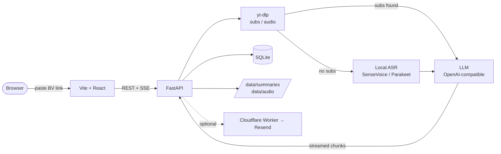

# biri-youyaku

[中文](README.md) | [English](README.en.md)

> `要約` (ようやく / yōyaku) means "summary" in Japanese; the same pronunciation
> also means "at last". `biri` comes from `ビリビリ`, Japanese for Bilibili.
>
> Inspired by [linzzzzzz/openclip](https://github.com/linzzzzzz/openclip) · [IndieKKY/bilibili-subtitle](https://github.com/IndieKKY/bilibili-subtitle)

Paste a Bilibili video link, fetch subtitles when available, fall back to audio
transcription, and generate a Markdown summary in one click. Optionally email the
result.

Each summary offers: Markdown notes (with a table of contents) / mind map / topic
tags / clickable transcript that jumps back into the video. You can also browse an
uploader's full catalog, see which videos are already summarized, and one-click the rest.

## 60-second quickstart

You need Python 3.11+, Node.js 22+ (see `.nvmrc`), [uv](https://docs.astral.sh/uv/), and `npm`.

```bash
# 1. Copy the env template and fill LLM_API_KEY (any OpenAI-compatible endpoint works)
cp server/.env.example server/.env
$EDITOR server/.env

# 2. Spin up backend + frontend dev servers (the script handles server/.env + web/.env + deps)
bash scripts/dev.sh
# Windows PowerShell: powershell -ExecutionPolicy Bypass -File scripts\dev.ps1
```

Open <http://127.0.0.1:5173> and paste any Bilibili video URL.

> Prefer Docker? `cp server/.env.example server/.env` then `docker compose up --build` (for hot-reload dev mode: `docker compose -f docker-compose.dev.yml up --build`).

---

## Project layout

- `web/` — Vite + React frontend.
- `server/` — FastAPI + SQLite backend.
- `examples/email-worker/` — optional Cloudflare Worker template for emailing summaries.
- `scripts/dev.sh`, `docker-compose.yml` — one-command local startup.

## Architecture



> All data stays in `server/data/` on your machine. No telemetry, no analytics —
> the only outbound traffic is to the LLM endpoint you configured and Bilibili.

---

## Pick an LLM API key

Any OpenAI-compatible endpoint works:

| Provider | Sample `LLM_BASE_URL` | Notes |
| --- | --- | --- |
| **DeepSeek** (default) | `https://api.deepseek.com/v1` | Model `deepseek-v4-flash`; thinking mode via `LLM_THINKING_ENABLED` |
| Moonshot / Kimi | `https://api.moonshot.cn/v1` | |
| Zhipu GLM | `https://open.bigmodel.cn/api/paas/v4` | |
| Google Gemini | `https://generativelanguage.googleapis.com/v1beta/openai` | OpenAI-compatible endpoint |
| OpenAI | `https://api.openai.com/v1` | |
| Anthropic Claude | `https://api.anthropic.com/v1` | |
| xAI Grok | `https://api.x.ai/v1` | |
| Local ollama / vLLM | `http://localhost:11434/v1` | |

Set `LLM_MODEL` to whatever your provider supports (default `deepseek-v4-flash`).

**Cost ballpark**: a 20-minute video with the default `deepseek-v4-flash` costs about ¥0.02
(input ¥1/M tokens, output ¥2/M).
Longer videos scale linearly with tokens. For fully free / offline, see the ollama recipe below.

### Fully local: ollama (free / offline / private)

```bash
# 1. Install ollama (https://ollama.com — macOS/Linux installers available).
ollama pull qwen2.5:3b   # 3B, runs in ~4 GB RAM; OK quality for summaries
# ollama pull qwen2.5:7b # better quality if you have the RAM

# 2. server/.env
LLM_BASE_URL=http://localhost:11434/v1
LLM_MODEL=qwen2.5:3b
LLM_API_KEY=ollama       # ollama ignores the key but it must be non-empty
LLM_BASE_URL_ALLOWED_HOSTS=  # local only; do not disable the allowlist in public deployments
```

All summarization now runs locally, no outbound traffic. Combine with the local ASR
section below for an end-to-end offline pipeline (except for the Bilibili fetch itself).

---

## Manual local dev

If you'd rather not use `scripts/dev.sh`:

```bash
# Backend
cd server
cp .env.example .env       # fill LLM_API_KEY
uv sync
uv run uvicorn biri_youyaku.app:app --reload --host 0.0.0.0 --port 17821

# Frontend (new terminal)
cd web
cp .env.example .env
npm install
npm run dev                # http://localhost:5173
```

---

## Optional features

### Bilibili login cookies (private / high-quality subtitles)

Log in on bilibili.com in your browser, copy `SESSDATA`, paste into `server/.env`:

```env
BILI_SESSDATA=your-sessdata
# Usually SESSDATA alone is enough; some endpoints want these too
# BILI_BUVID3=
# BILI_BILI_JCT=
```

### Local ASR (videos without subtitles)

You need `ffmpeg` / `ffprobe`; macOS `brew install ffmpeg`, Ubuntu `apt install ffmpeg`.

**Cross-platform (default) — funasr CPU backend:**

```bash
cd server
uv sync --extra asr     # installs funasr + torch
# server/.env
ASR_MODEL=sensevoice    # the default; can be omitted
```

**Apple Silicon Mac (M1+) — MLX backend (recommended, 15-30× faster):**

```bash
cd server
uv sync --extra asr-mlx # installs mlx-audio + parakeet-mlx
```

Available `ASR_MODEL` values:

| `ASR_MODEL` | Best for | Notes |
| --- | --- | --- |
| `sensevoice` | Cross-platform, Docker | funasr CPU, slow but portable |
| `sensevoice-mlx` | M-series Mac, CJK videos | Same weights, runs on GPU/ANE |
| `parakeet-mlx` | M-series Mac, English / European | NVIDIA Parakeet TDT v3, 6.34% WER (beats Whisper-Large-v3) |
| `auto` | Don't want to choose | Routes by job language: CJK → sensevoice-mlx, else → parakeet-mlx |
| `faster-whisper` | Existing whisper workflow | CTranslate2-optimized |

Mac mini M4 recommendation: `ASR_MODEL=auto`.

### Email delivery

> Email is **disabled by default** — you bring your own webhook. The repo ships a
> Cloudflare Worker template:

```bash
cd examples/email-worker
# Follow examples/email-worker/README.md, ~5 minutes
```

Then in `server/.env`:

```env
EMAIL_ENABLED=true
EMAIL_WEBHOOK_URL=https://biri-youyaku-mail.<account>.workers.dev
EMAIL_WEBHOOK_TOKEN=must match the Worker's BIRI_YOUYAKU_TOKEN
EMAIL_DEFAULT_RECIPIENT=you@example.com
```

If `EMAIL_ENABLED=true` but any of `EMAIL_WEBHOOK_URL` / `EMAIL_WEBHOOK_TOKEN` /
`EMAIL_DEFAULT_RECIPIENT` is empty, the server logs a WARN and refuses to create
jobs to avoid sending to the wrong address. When using the bundled Worker,
`EMAIL_WEBHOOK_TOKEN` must match the Worker's `BIRI_YOUYAKU_TOKEN`.

---

## More docs

- [`DEPLOY.md`](DEPLOY.md) — public deployment (Vercel + Cloudflare Tunnel).
- [`CONFIG.md`](CONFIG.md) — full `server/.env` reference.
- [`CONTRIBUTING.md`](CONTRIBUTING.md) — dev flow, tests, commit conventions.
- [`AGENTS.md`](AGENTS.md) — codebase tour for AI coding tools.
- [`CHANGELOG.md`](CHANGELOG.md) — release notes.

Full API list is at `GET /docs` (FastAPI auto-generated). Most-used:

```
GET  /healthz                       liveness
GET  /v1/version                    backend version
GET  /v1/config/runtime             which capabilities are configured
POST /v1/jobs                       create a job
GET  /v1/jobs                       history
GET  /v1/jobs/{id}/stream           SSE stream
GET  /v1/up/{mid}/videos            an uploader's videos (flags which are summarized)
GET  /v1/up/resolve                 space URL / UID / video URL → mid
```

---

## License

MIT
