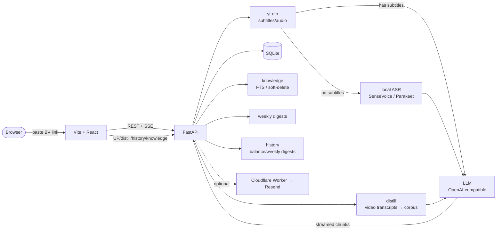

# biri-youyaku

[中文](README.md) | [English](README.en.md)

Paste a Bilibili video link and get a readable Markdown summary, a mind map, and a clickable transcript. Local-first, self-hosted, no telemetry.

<!-- Demo: drop a screenshot/GIF in assets/ then uncomment the line below

-->

> `要約` (yōyaku) is Japanese for "summary"; the homophone also means "finally". `biri` comes from `ビリビリ`, the Japanese nickname for Bilibili.
> Inspired by [linzzzzzz/openclip](https://github.com/linzzzzzz/openclip) and [IndieKKY/bilibili-subtitle](https://github.com/IndieKKY/bilibili-subtitle).

## ✨ Features

- **Subtitles first**: use official subtitles when present, otherwise download audio and transcribe locally (ASR).
- **Multi-view summary**: Markdown notes (with a table of contents) / mind map (export SVG·PNG) / topic tags / transcript (click a timestamp to jump back into the video).
- **Any LLM**: any OpenAI-compatible endpoint (DeepSeek by default; OpenAI / Gemini / local ollama all work).
- **Browse by uploader**: list an uploader's whole catalog, see which are summarized, one-click the rest.
- **Uploader corpus distillation**: scrape an uploader's video transcripts, extract viewpoints with LLM, and compile them into a persona corpus (e.g. for roleplay).
- **Personal knowledge base**: register completed summaries; local FTS search; optional chat (off by default); soft-delete / restore / purge.
- **History balance & weekly digests**: the history page currently shows API balance and weekly summaries (no standalone `/stats` route).
- **Dedup to save tokens**: re-pasting an already-summarized video reuses the old result.
- **Per-job fixes**: resummarize (reuse existing transcript), force re-transcription (ignore existing transcript/subtitles and redo ASR), resend email for a failed job.
- **Audio download**: download the audio file used for transcription.
- **Local-first**: all data stays local, no telemetry; optional email delivery and optional API-token auth.

## 🚀 Quick start

Requires Python 3.11+, Node.js 22+ (see `.nvmrc`), [uv](https://docs.astral.sh/uv/), and `npm`.

```bash
cp server/.env.example server/.env   # set LLM_API_KEY (DeepSeek by default)
bash scripts/dev.sh                  # starts both servers (auto-copies .env, installs deps)
```

Open <http://127.0.0.1:5173> and paste a Bilibili link.

> Windows: `powershell -ExecutionPolicy Bypass -File scripts\dev.ps1`
> Docker: `docker compose up --build` (hot-reload via `docker compose -f docker-compose.dev.yml up --build`). Default server image **does not install ASR extras** (funasr/torch); for no-subtitle videos edit Dockerfile to `uv sync --extra asr`.

<details>
<summary>Run the two servers manually</summary>

```bash
# backend
cd server && cp .env.example .env && uv sync
uv run uvicorn biri_youyaku.app:app --reload --host 0.0.0.0 --port 17821

# frontend (new terminal)
cd web && cp .env.example .env && npm install && npm run dev   # http://localhost:5173
```

</details>

## 🖥️ macOS always-on API (LaunchAgent)

On a Mac Mini (or any always-on Mac) with **host MLX ASR**, keep the API running without a terminal:

```bash
bash scripts/mac-service.sh install    # write LaunchAgent and start (no --reload)
bash scripts/mac-service.sh restart    # after code / deps / .env changes
bash scripts/mac-service.sh stop       # free port 17821 before dev
bash scripts/mac-service.sh logs       # ~/Library/Logs/biri-youyaku/
```

- **Production**: LaunchAgent only; no need to leave Ghostty open.
- **Development**: `stop` first, then `scripts/dev.sh` (hot reload); `start` again when done.
- **Docker**: default compose **has no MLX ASR** — not ideal for frequent on-Mac ASR. See [`docs/runbooks/macos-service.md`](docs/runbooks/macos-service.md).

## ⚙️ LLM configuration

Any OpenAI-compatible endpoint works. Set at least `LLM_API_KEY` in `server/.env`:

| Provider | `LLM_BASE_URL` |
| --- | --- |
| **DeepSeek** (default) | `https://api.deepseek.com/v1` |
| OpenAI | `https://api.openai.com/v1` |
| Google Gemini | `https://generativelanguage.googleapis.com/v1beta/openai` |
| Local ollama / vLLM | `http://localhost:11434/v1` |

Set `LLM_MODEL` to a model the provider supports (default `deepseek-v4-flash`). See [`CONFIG.md`](CONFIG.md) for more providers and every option.

> **Cost**: the default model summarizes a 20-minute video for about ¥0.02; go fully free with local ollama below.

<details>
<summary>Fully local / free / offline (ollama)</summary>

```bash
ollama pull qwen2.5:3b        # runs in 4GB RAM, fine for summaries; use qwen2.5:7b if you can
```

```env
# server/.env
LLM_BASE_URL=http://localhost:11434/v1
LLM_MODEL=qwen2.5:3b
LLM_API_KEY=ollama            # ollama ignores it but it must be non-empty
LLM_BASE_URL_ALLOWED_HOSTS=   # leave empty for local only; never open the allowlist in production
```

Combined with local ASR below, this is fully offline (except fetching from Bilibili).

</details>

## 🧩 Optional features

- **Local ASR** (videos without subtitles): needs `ffmpeg`. Cross-platform `cd server && uv sync --extra asr`; on Apple Silicon use `--extra asr-mlx` (15-30× GPU/ANE speedup). Switch backends with `ASR_MODEL` (see table below).
- **Bilibili login** (private videos / better subtitles): copy `SESSDATA` from your browser cookies into `BILI_SESSDATA` in `server/.env`.
- **Email delivery** (off by default): use the bundled Cloudflare Worker template — follow [`examples/email-worker/README.md`](examples/email-worker/README.md), then enable `EMAIL_ENABLED` etc. in `server/.env`.

<details>
<summary>ASR backends</summary>

| `ASR_MODEL` | Best for | Notes |
| --- | --- | --- |
| `sensevoice` (default) | cross-platform, Docker | funasr CPU, slow but portable |
| `sensevoice-mlx` | Apple Silicon, CJK | same model/accuracy, uses GPU/ANE |
| `parakeet-mlx` | Apple Silicon, EN/EU | NVIDIA Parakeet TDT v3 |
| `auto` | don't want to choose | CJK → sensevoice-mlx, else → parakeet-mlx |
| `faster-whisper` | existing whisper setup | CTranslate2 build |

</details>

## 🏗️ Architecture


```mermaid
flowchart LR
    user([Browser]) -->|paste BV link| web[Vite + React]
    web -->|REST + SSE| api[FastAPI]
    web -->|UP/distill/history/knowledge| api
    api --> ytdlp[yt-dlp<br/>subtitles/audio]
    ytdlp -->|has subtitles| llm
    ytdlp -->|no subtitles| asr[local ASR<br/>SenseVoice / Parakeet]
    asr --> llm[LLM<br/>OpenAI-compatible]
    api --> distill[distill<br/>video transcripts → corpus]
    distill --> llm
    llm -->|streamed chunks| api
    api --> db[(SQLite)]
    api --> knowledge[knowledge<br/>FTS / soft-delete]
    api --> weekly[weekly digests]
    api --> stats[history<br/>balance/weekly digests]
    api -. optional .-> mail[Cloudflare Worker → Resend]
```

> All data stays local (`server/data/`); nothing is reported to third parties besides the LLM endpoint and Bilibili. No telemetry.
> Weekly timezone, knowledge backup, and related knobs: [`CONFIG.md`](CONFIG.md).

## 📦 Deploy & docs

- Same-host: `docker compose up --build` (Web `5173`, API `17821`)
- Public split: [`DEPLOY.md`](DEPLOY.md) — Vercel frontend + Cloudflare Tunnel backend
- [`CONFIG.md`](CONFIG.md) — every `server/.env` option

Pre-commit local checks: `cd server && uv run pytest -q && uv run ruff check .`, `cd web && npm run build` (includes tsc).

Full API at `/docs` once the backend is running (auto-generated by FastAPI).

## License

MIT
