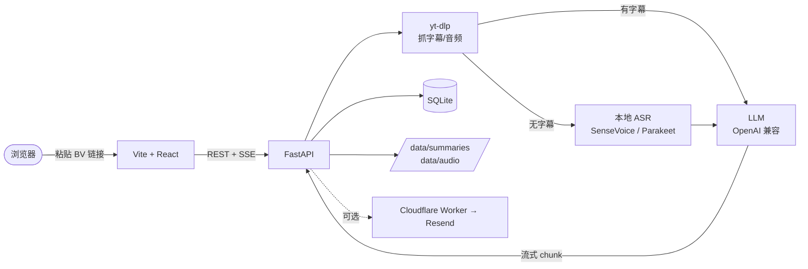

# biri-youyaku

[中文](README.md) | [English](README.en.md)

> `要約`（ようやく / yōyaku）在日语里是「摘要、总结」，同音 `ようやく` 又有「终于」之意。
> `biri` 来自 Bilibili 的日语口语叫法 `ビリビリ`。
>
> 灵感：[linzzzzzz/openclip](https://github.com/linzzzzzz/openclip) · [IndieKKY/bilibili-subtitle](https://github.com/IndieKKY/bilibili-subtitle)

粘贴 B 站视频链接，先取字幕；没字幕则下载音频转写。一键生成摘要，也可以发到邮箱。

## 60 秒快速开始

需要 Python 3.11+、Node.js 22+（见 `.nvmrc`）、[uv](https://docs.astral.sh/uv/)、`npm`。

```bash
# 1. 拷一份配置 + 填你的 LLM_API_KEY（OpenAI / 通义 / Moonshot 等 OpenAI 兼容接口都行）
cp server/.env.example server/.env
$EDITOR server/.env

# 2. 一键起前后端 dev server（脚本会自动 cp web/.env、装依赖）
bash scripts/dev.sh
# Windows PowerShell：powershell -ExecutionPolicy Bypass -File scripts\dev.ps1
```

打开 <http://127.0.0.1:5173>，粘贴一个 B 站视频链接即可。

> 想用 Docker？`cp server/.env.example server/.env` 之后 `docker compose up --build`（开发模式带 hot reload：`docker compose -f docker-compose.dev.yml up --build`）。

---

## 项目结构

- `web/`：前端（Vite + React）。
- `server/`：后端（FastAPI + SQLite）。
- `examples/email-worker/`：可选的 Cloudflare Worker 模板，把总结发到邮箱。
- `scripts/dev.sh`、`docker-compose.yml`：本地一键启动。

## 架构



> 数据全部落在本地（`server/data/`）。除了主动调用的 LLM 接口和 B 站，
> 项目不向任何第三方上报数据，无遥测、无统计。

---

## 准备一份 LLM API Key

任何 OpenAI 兼容接口都行。常见选择：

| 供应商 | `LLM_BASE_URL` 示例 | 备注 |
| --- | --- | --- |
| OpenAI | `https://api.openai.com/v1` | 标准接口 |
| Moonshot / Kimi | `https://api.moonshot.cn/v1` | 后端会强制 `temperature=1` |
| 通义千问 DashScope | `https://dashscope.aliyuncs.com/compatible-mode/v1` | |
| DeepSeek | `https://api.deepseek.com` | |
| 本地 ollama / vLLM | `http://localhost:11434/v1` | 模型名按本地实际 |

`LLM_MODEL` 填供应商支持的模型名（`gpt-4o-mini` / `moonshot-v1-32k` / `qwen-plus` 等）。

**成本参考**：用 `gpt-4o-mini` 总结一个 20 分钟视频大约 $0.005（一杯水的钱）。
长视频按 token 线性增加；想完全免费走下面的本地 ollama 即可。

### 完全本地：ollama（免费 / 离线 / 隐私）

```bash
# 1. 装 ollama（macOS / Linux 都有官方安装包）：https://ollama.com
ollama pull qwen2.5:3b   # 3B 模型，4GB 内存可跑；中文摘要够用
# ollama pull qwen2.5:7b # 内存够建议这个，质量更好

# 2. server/.env
LLM_BASE_URL=http://localhost:11434/v1
LLM_MODEL=qwen2.5:3b
LLM_API_KEY=ollama       # ollama 不校验，但不能为空
```

跑通后，所有摘要本地推理、不出网。配合下面「本地 ASR 转写」就能做到端到端零联网（B 站抓数据除外）。

---

## 本地开发（手动）

不想用 `scripts/dev.sh`？分别起：

```bash
# 后端
cd server
cp .env.example .env       # 填 LLM_API_KEY
uv sync
uv run uvicorn biri_youyaku.app:app --reload --host 0.0.0.0 --port 17821

# 前端（新终端）
cd web
cp .env.example .env
npm install
npm run dev                # http://localhost:5173
```

---

## 可选功能

### B 站登录态（取私享视频 / 高画质字幕）

浏览器登录 B 站后，从 cookie 复制 `SESSDATA`，写到 `server/.env`：

```env
BILI_SESSDATA=你的-sessdata
# 大多数情况只配 SESSDATA 就够；某些接口需要再补
# BILI_BUVID3=
# BILI_BILI_JCT=
```

### 本地 ASR 转写（无字幕的视频）

需要 `ffmpeg` / `ffprobe`；Mac `brew install ffmpeg`，Ubuntu `apt install ffmpeg`。

**跨平台（默认）—— funasr CPU 后端**：

```bash
cd server
uv sync --extra asr     # 装 funasr + torch
# server/.env
ASR_MODEL=sensevoice    # 默认就是这个，可省
```

**Apple Silicon Mac（M1+）—— MLX 后端（推荐，15-30× 加速）**：

```bash
cd server
uv sync --extra asr-mlx # 装 mlx-audio + parakeet-mlx
```

可选 ASR 后端：

| `ASR_MODEL` | 适合 | 备注 |
| --- | --- | --- |
| `sensevoice` | 跨平台、Docker | funasr CPU，慢但兼容 |
| `sensevoice-mlx` | M 系列 Mac、中日韩视频 | 同模型同精度，吃 GPU/ANE |
| `parakeet-mlx` | M 系列 Mac、英语 / 欧语 | NVIDIA Parakeet TDT v3，WER 6.34%（超 Whisper-Large-v3） |
| `auto` | 不想纠结 | 按任务语言路由：CJK → sensevoice-mlx，其余 → parakeet-mlx |
| `faster-whisper` | 已有 whisper 工作流 | CTranslate2 优化版 |

Mac mini M4 推荐：`ASR_MODEL=auto`。

### 邮件发送

> 邮件**默认关闭**，需要自己起一个 webhook。仓库里给了一个 Cloudflare Worker 模板：

```bash
cd examples/email-worker
# 跟着 examples/email-worker/README.md 走，5 分钟部完
```

部完后到 `server/.env`：

```env
EMAIL_ENABLED=true
EMAIL_WEBHOOK_URL=https://biri-youyaku-mail.<account>.workers.dev
EMAIL_WEBHOOK_TOKEN=与 Worker 的 BIRI_YOUYAKU_TOKEN 一致
EMAIL_DEFAULT_RECIPIENT=you@example.com
```

启动时若开了 `EMAIL_ENABLED` 但任一必填值为空，后端会打 WARN；创建任务时也会拒
绝，避免发到错误地址。

---

## 更多文档

- [`DEPLOY.md`](DEPLOY.md)：公网部署（Vercel + Cloudflare Tunnel）。
- [`CONFIG.md`](CONFIG.md)：`server/.env` 所有可调项的完整表。
- [`CONTRIBUTING.md`](CONTRIBUTING.md)：开发流程、测试、commit 规范。
- [`AGENTS.md`](AGENTS.md)：给 AI 编程助手的代码库导览。
- [`CHANGELOG.md`](CHANGELOG.md)：版本变更。

完整 API 列表见 `GET /docs`（FastAPI 自动生成）。常用：

```
GET  /healthz                       后端存活
GET  /v1/version                    后端版本号
GET  /v1/config/runtime             各能力是否已配置
POST /v1/jobs                       建任务
GET  /v1/jobs                       历史列表
GET  /v1/jobs/{id}/stream           SSE 流式订阅
```

---

## License

MIT
