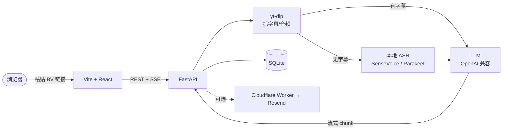

# biri-youyaku

[中文](README.md) | [English](README.en.md)

粘贴 B 站视频链接，自动生成可读的 Markdown 摘要、思维导图与可跳转字幕。本地优先、自托管、无遥测。

<!-- 演示图：把截图/GIF 放到 assets/，再取消下面这行注释

-->

> `要約`（ようやく / yōyaku）日语里是「摘要、总结」，同音又有「终于」之意；`biri` 取自 Bilibili 的日语叫法 `ビリビリ`。
> 灵感：[linzzzzzz/openclip](https://github.com/linzzzzzz/openclip) · [IndieKKY/bilibili-subtitle](https://github.com/IndieKKY/bilibili-subtitle)

## ✨ 特性

- **字幕优先**：先取官方字幕，没有则下载音频本地转写（ASR）。
- **多视图摘要**：Markdown 笔记（带目录）/ 思维导图（可导出 SVG·PNG）/ 主题标签 / 字幕原文（点时间戳跳回视频）。
- **任意 LLM**：任何 OpenAI 兼容接口（默认 DeepSeek，OpenAI / Gemini / 本地 ollama 等都行）。
- **按 UP 主浏览**：列出某 UP 全部投稿、标记已/未总结、未总结一键补。
- **去重省钱**：同一视频已总结过就直接复用，不重复烧 token。
- **本地优先**：数据全落本地、无遥测；可选邮件推送、可选 API Token 鉴权。

## 🚀 快速开始

前置：Python 3.11+、Node.js 22+（见 `.nvmrc`）、[uv](https://docs.astral.sh/uv/)、`npm`。

```bash
cp server/.env.example server/.env   # 填 LLM_API_KEY（默认走 DeepSeek）
bash scripts/dev.sh                  # 一键起前后端（自动 cp .env、装依赖）
```

打开 <http://127.0.0.1:5173>，粘贴一个 B 站视频链接即可。

> Windows：`powershell -ExecutionPolicy Bypass -File scripts\dev.ps1`
> Docker：`docker compose up --build`（热重载用 `docker compose -f docker-compose.dev.yml up --build`）。

<details>
<summary>不用脚本，手动分别起</summary>

```bash
# 后端
cd server && cp .env.example .env && uv sync
uv run uvicorn biri_youyaku.app:app --reload --host 0.0.0.0 --port 17821

# 前端（新终端）
cd web && cp .env.example .env && npm install && npm run dev   # http://localhost:5173
```

</details>

## ⚙️ LLM 配置

任何 OpenAI 兼容接口都行，`server/.env` 里至少填 `LLM_API_KEY`：

| 供应商 | `LLM_BASE_URL` |
| --- | --- |
| **DeepSeek**（默认） | `https://api.deepseek.com/v1` |
| OpenAI | `https://api.openai.com/v1` |
| Google Gemini | `https://generativelanguage.googleapis.com/v1beta/openai` |
| 本地 ollama / vLLM | `http://localhost:11434/v1` |

`LLM_MODEL` 填供应商支持的模型名（默认 `deepseek-v4-flash`）。更多供应商与全部可调项见 [`CONFIG.md`](CONFIG.md)。

> **成本参考**：默认模型总结一个 20 分钟视频约 ¥0.02；想完全免费走下面的本地 ollama。

<details>
<summary>完全本地 / 免费 / 离线（ollama）</summary>

```bash
ollama pull qwen2.5:3b        # 4GB 内存可跑，中文摘要够用；内存够可换 qwen2.5:7b
```

```env
# server/.env
LLM_BASE_URL=http://localhost:11434/v1
LLM_MODEL=qwen2.5:3b
LLM_API_KEY=ollama            # ollama 不校验，但不能为空
LLM_BASE_URL_ALLOWED_HOSTS=   # 仅本地留空；公网部署不要放开白名单
```

配合下面的本地 ASR，即可端到端零联网（B 站抓数据除外）。

</details>

## 🧩 可选功能

- **本地 ASR 转写**（无字幕的视频）：需 `ffmpeg`。跨平台 `cd server && uv sync --extra asr`；Apple Silicon 用 `--extra asr-mlx`（GPU/ANE 加速 15-30×）。用 `ASR_MODEL` 切换后端（见下表）。
- **B 站登录态**（取私享视频 / 高画质字幕）：浏览器登录后复制 cookie 里的 `SESSDATA`，填到 `server/.env` 的 `BILI_SESSDATA`。
- **邮件推送**（默认关闭）：用仓库自带的 Cloudflare Worker 模板，跟着 [`examples/email-worker/README.md`](examples/email-worker/README.md) 走，再在 `server/.env` 开 `EMAIL_ENABLED` 等。

<details>
<summary>ASR 后端对比</summary>

| `ASR_MODEL` | 适合 | 备注 |
| --- | --- | --- |
| `sensevoice`（默认） | 跨平台、Docker | funasr CPU，慢但兼容 |
| `sensevoice-mlx` | M 系列 Mac、中日韩 | 同模型同精度，吃 GPU/ANE |
| `parakeet-mlx` | M 系列 Mac、英语/欧语 | NVIDIA Parakeet TDT v3 |
| `auto` | 不想纠结 | CJK → sensevoice-mlx，其余 → parakeet-mlx |
| `faster-whisper` | 已有 whisper 工作流 | CTranslate2 优化版 |

</details>

## 🏗️ 架构



> 数据全部落在本地（`server/data/`）；除主动调用的 LLM 接口和 B 站外，不向任何第三方上报，无遥测、无统计。

## 📦 部署与文档

- [`DEPLOY.md`](DEPLOY.md) — 公网部署（Vercel + Cloudflare Tunnel）
- [`CONFIG.md`](CONFIG.md) — `server/.env` 全部可调项
- [`CONTRIBUTING.md`](CONTRIBUTING.md) — 开发 / 测试 / 提交
- [`AGENTS.md`](AGENTS.md) — 给 AI 编程助手的代码库导览
- [`CHANGELOG.md`](CHANGELOG.md) — 版本变更

完整 API 见后端运行后的 `/docs`（FastAPI 自动生成）。

## License

MIT
