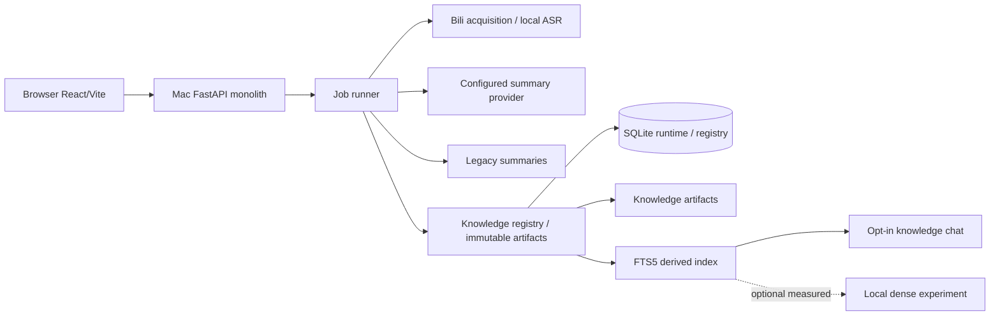
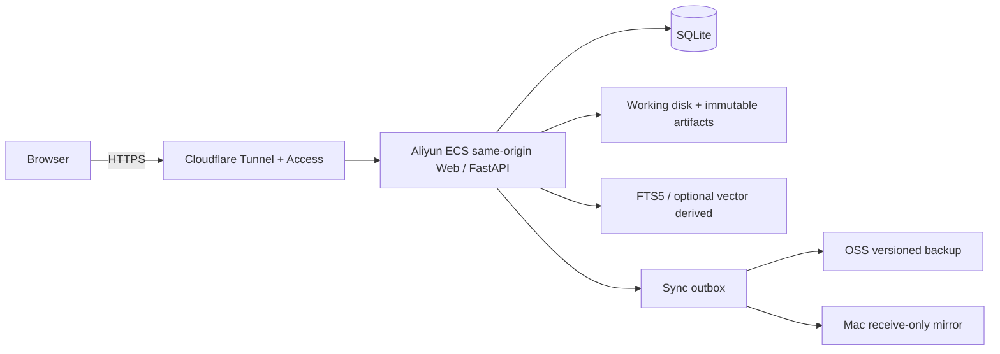
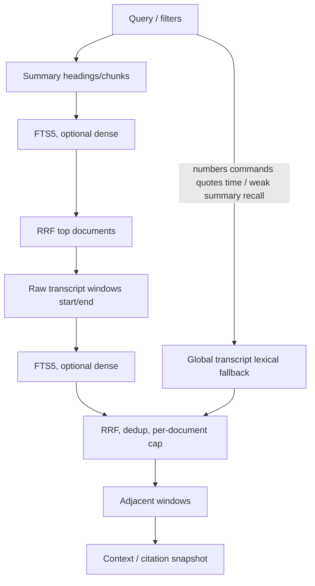

# 2026-07-29 Bilibili 总结器到双层个人知识库（RAG）

> 本计划修订待确认前不得编码；确认后 **A0 是唯一立即执行的批次**。其余批次必须按门槛顺序放行。

## 目标、锁定默认与 Phase 结果

目标顺序固定：保护 Bilibili 数据并把 distill 收敛为 UP 投稿视频；登记既有 Bili 总结与原始转写；FTS-first 评测及“基于总结的知识问答”；转写证据 RAG；最后删除协调、备份和 Aliyun 迁移。P0–P2 只实现/测试 Bilibili。

锁定默认：video-only distill；COMPLETED 无限保留至显式操作；旧 summary 字节/路径不变；`document_id` 为 opaque UUID/ULID，Bili `(bvid,cid)` 为 metadata 后的外部唯一键；job link 以 `job_id` 唯一；FTS-only 默认；dense 仅本地可测实验；remote embedding 关闭；知识聊天单独 opt-in。只有聊天入口的导航位置仍可在产品层面后定。

Phase-1（B）：用户提交 Bili URL 后，现有总结、SSE、邮件、脑图、下载和视频周总结不变；完成 job 自动登记；用户可做**基于总结的知识问答**，引用为“AI 总结”标题/段落。Phase-2（C）：数字、事实、步骤、引述和时间问题可给 transcript 证据；无证据拒答/降级。Mac 在 P0–P1.5 是唯一运行时；P2 后才切到 ECS writer。

非目标：本期不实现 YouTube、上传、粘贴、TXT/MD、PDF、DOCX、图片 OCR、网页、通用 ingestion pipeline、双向同步、多人协作或服务化向量库。`data/exports` 便携 Markdown 不属于 P0–P2 合同、存储或删除语义，仅为 P3 后续议题。

## 当前证据、兼容契约与保留矩阵

- 当前 Mac 运行 React/Vite → FastAPI `/v1/jobs` → Bili metadata/平台字幕，缺失时 yt-dlp 音频+本地 ASR → LLM → `server/data/summaries/<job-id>.md` + SQLite jobs/transcript/status → SSE/UI。
- summary 正文被 ReactMarkdown、脑图、复制下载、邮件和周总结使用，周总结还以正文身份计算失效指纹。既有 summary 初期必须**字节完全一致**：不加 frontmatter、不移路径、不格式化/重编码。
- 当前 `job_retention_days=180` 且 `RETENTION_DELETE_JOB_STATUSES` 含 COMPLETED，是必须先修的完成内容丢失风险。

| 对象/状态 | 自动保留策略 | 手工删除语义 | 生效批次 |
| --- | --- | --- | --- |
| audio（任何状态） | 7 天后删音频并清 audio path | 可即时清理音频，不影响 transcript/summary | 自动：**A0**；手工音频清理：既有行为 |
| COMPLETED 或 `summary_path` 非空 | job/summary/transcript **自动**无限保留 | history 删除：A3 起仅 unlink job link，不等于删知识文档；A3 前仍按既有逻辑删 job 行与 legacy summary | 自动：**A0**；history→unlink：**A3** |
| TRANSCRIPT_READY | 不自动删除 | 明确操作前保留 transcript | 自动：**A0** |
| FAILED/CANCELED 且无 summary | 180 天后删 job/transcript | 可手动删除 job/transcript | 自动：**A0** |
| knowledge artifacts | 至明确永久 document 删除 | 软删可恢复；永久删独立二次确认与审计 | 登记/unlink：**A3**；soft/permanent UI：**D** |

**生效说明（实现与验收边界）**

- **自动保留策略**：A0 起生效并测试。A0 验收范围仅限上表「自动」列中已存在于 jobs/cleanup 的对象：audio、COMPLETED/`summary_path` 非空、TRANSCRIPT_READY、FAILED/CANCELED 且无 summary。**不含** knowledge artifacts 行（表与文件在 A3 才创建）。
- **手动 history → unlink + 保留 knowledge**：A3 起生效；此前手动/ bulk 删除仍可能移除 job 行与 `data/summaries/<job-id>.md` 及 job 内 `transcript_json`。
- **knowledge permanent delete（含二次确认/审计）**：D 起提供完整 lifecycle。
- **A0 发布后至 A3 回填完成前**：避免对 COMPLETED 做 bulk history 删除；若必须清理，先离线备份 DB + `data/summaries` 再操作。A3 回填开始前建议做一次可校验快照（DB + summaries 清单与 SHA-256）。

COMPLETED 自动无限保留不能替代手动删除保护：A3 起 history 删除事务必须解除 job link、保留已登记 artifacts；永久 document 删除在 D 另行确认。A0 **单独发布**，只验证自动保留矩阵行。

## 已采用的证据、规范化与引用规则

summary 层只做相关视频发现、概览与跨视频主题；transcript 层做事实、数字、步骤、引述、命令和时间证据，绝不嵌入视频二进制。raw transcript segment（`start/end/raw_text/source=platform|asr`）不可变且权威；原始 artifact hash 后独立存放。normalized transcript 是可选、版本化的检索派生物，保留 raw segment/time-range 映射、`raw_text`、`normalized_text`、method/reason、normalizer/version；可始终从 raw + version 重建。

安全规范化限标点、空白/大小写、重复/碎片拼接、以及以标题/简介/tags/作者/项目词表作高置信术语修正；不静默重写不确定的人名、数字、日期、模型/产品标识、命令或逐字引述。C 先索引 immutable raw baseline；normalizer 仅在 locked holdout recall 有提升且高风险值零不可追溯改写时作为独立 A/B 版本开启。

`source_level=summary` UI 写“AI 总结：标题/段落”，不得伪造时间；`source_level=transcript` 显示 `mm:ss–mm:ss`、平台字幕记录或“ASR 转写，可能存在识别误差”。高风险答案若只有 ASR，须降确定性、提示风险并给时间范围人工核验，不可发明置信度；无 transcript 证据则拒答或标“总结中提到”。服务端校验 citation ID、revision、可见性与 locator 后构造 URL/时间戳。

summary chunker 预期 `## TL;DR`、`## 笔记`、`###` 子标题，及可选 `## 收束`/`字幕质量备注`；标题缺失或无效时只建一个 whole-document chunk，locator 为“AI 总结：全文”，绝不虚构标题。

## 隐私与 egress 矩阵

| 业务/数据 | 当前或计划 egress | 默认与边界 |
| --- | --- | --- |
| summary/tags/weekly/distill | 已配置 OpenAI-compatible provider（默认配置 DeepSeek） | 现有行为，服务端 secret；日志不记录内容/token |
| Bili metadata/subtitle/cookie | Bilibili 边界 | cookie 仅服务端；不写日志/前端 |
| ASR | 本地 | 音频/转写不默认外发 |
| email webhook | recipient、subject、summary 等既有字段 | 仅已配置 webhook；token 服务端 |
| knowledge chat | query + 已选 chunks 到 chat provider | 新功能独立 opt-in，默认关闭；开关形态（env / config）可在 B 前定，**B 验收必须证明默认关、打开后才外发** |
| remote embedding | query/chunks | P1 默认关闭；本地 dense 实验独立启用 |
| OCR | P3 | 默认关闭，须独立同意 |

build-time token 不足以保护公开写接口；P2 使用 Cloudflare Access 或私网边界。所有 secrets 仅在服务端，日志无内容/token。当 `API_TOKEN` 非空时，计划中的 `/v1/knowledge/*` 与 jobs 同级走既有 `require_token`（或更严）；token 为空仍视为单用户本机信任模型。未来上传另案处理类型/大小限制与 SSRF。

## 分阶段架构与处理流程

### P0–P1.5：Mac 本地单体（无 OSS/outbox）

摄入：submit URL → validate/dedupe → metadata → platform subtitle，否则音频+ASR → immutable raw transcript →（可选版本化 normalization）→ **既有** summary generation 不变 → legacy summary + 独立 summary/raw transcript artifact → document/revisions/artifacts/job link → 异步 index/reconcile。summary 成功不得因 registry/index 失败而失败；后者以 persisted `pending/failed` reconcile 状态重试。P0/P1.5 不写 backup/sync outbox。

### P2：ECS 单 writer 与只出站备份

Cloudflare DNS 独立于托管；Tunnel 是私有 ECS HTTPS ingress，Access 提供身份。切换后 ECS 是唯一 writer；OSS 为版本化备份，Mac 仅接收 Markdown/artifact copy。禁止 network-mount Mac 目录，禁止双向同步活动 SQLite/WAL。

### 双层检索与聊天序列

聊天：query → filters/query analysis → summary discovery；B 的 summary-only MVP 到最低证据阈值后调用现有 OpenAI-compatible model，SSE delta 并仅给 summary citation。C 则在候选 document 内找 transcript evidence，必要时 global lexical fallback；reranker 只在实测收益后启用。服务端固化 snapshot、校验结构化 citations，UI 呈现 source cards 与跳转时间。普通错字由 FTS 精确项+dense 语义缓解，有限 known-alias expansion 可用；v1 不做宽泛拼音/fuzzy。

## 最小 schema、所有权与 API 时序

| 阶段 | schema/存储 | 责任与真相 |
| --- | --- | --- |
| A3 | documents、content revisions、summary revisions、artifacts、job links、reconcile state | registry 事务真相；复制 legacy summary 与 immutable raw transcript |
| B | `rag_chunks`、FTS5 | 从 active artifacts/revisions 可全量重建 |
| B dense experiment | sqlite-vec/vector metadata | 派生物，失败 FTS-only；锁 stable exact-KNN 版本 |
| C | transcript chunks/normalizer versions | raw artifact 权威；normalized 可重建 |
| chat persistence 时 | conversations/messages | 仅聊天落地时创建，不提前迁移 |

legacy summary 是当前产品真相且不变；knowledge artifacts 是耐久证据；SQLite 保存 runtime/registry/reconcile（P2 加 outbox）；FTS/vector 是派生物；audio 是 7 天临时物；OSS 是可恢复副本，Mac mirror 不参与写入。

既有 `/v1/jobs` 和 job SSE 不变。计划 API：`GET /v1/knowledge/search`、`POST /v1/knowledge/chat` SSE、documents delete/restore/rebuild/status。registry 仅对普通 Bili summary job：状态 COMPLETED 且 `summary_path` 存在后执行；排除 distill/audio job；metadata 已知后以 `(bilibili, bvid, cid)` 找外部 document，`job_id` link 唯一。

**登记身份与重总结（A3 写死）**

- 外部唯一键：`(provider=bilibili, bvid, cid)`。同一键上多个 job → 多条 `job_links`、**一个** document。
- `bvid` 或 `cid` 缺失（旧 job / 失败 meta / 异常回填）：**不创建 document**；写入 reconcile `failed` 并记录原因，可人工补 meta 后重扫；禁止退化为仅 bvid 合并（避免多分 P 误并）。
- **重总结**：同一 document 新增 `summary_revision`（新 artifact/hash）；若 raw transcript hash 未变则**复用**既有 content revision，不复制第二份 transcript。
- 最佳努力登记必须持久化 reconcile state（`pending`/`failed`/成功），并由启动/维护扫描补齐；registry/index 失败不得将 job 标 FAILED。

## 评测、资源门槛与成熟度

评测语料必须同时有 committed synthetic deterministic fixtures 和 private local real corpus；不得以空 corpus 通过。初始 release gate：至少 20 视频、80 条可回答 query、20 条 no-answer，适用 critical category 各至少 10 条，30% locked holdout。阈值版本化，只有记录理由才能调整：summary Recall@5 ≥0.90、MRR@10 ≥0.75、summary citation correctness ≥0.95、no-answer precision/recall 各 ≥0.90；transcript evidence Recall@5 ≥0.85、citation/time-range gold overlap ≥0.95、citation structure validity 100%；numbers/entities/commands/quotes 为零不可追溯 rewrite。

**Gate 未达标时的默认策略（禁止为过线污染 holdout）**

1. 允许 **search-only** 内部可用，**knowledge chat 保持默认关闭**（或仅开发开关）。
2. 允许临时下调数值 gate，但必须在计划实施备注写清：旧值、新值、语料版本、失败样例类别、原因；不得为过 gate 改 prompt/标注去贴 holdout。
3. 禁止宣称「生产级 RAG / 证据问答就绪」直至对应 B 或 C 的 holdout 达标。
4. dense / reranker / normalizer 未过线时保持关闭，不影响 FTS-only 路径。

B 默认 FTS-only：1,000-document benchmark search p95 ≤200ms、FTS backfill peak RSS 增量 ≤512MB、每批 100 且可 resumable（benchmark 可用合成负载，不要求真实语料已有 1000 文档）。dense 是可选实验，报告 Mac/Aliyun p50/p95、index time、peak RSS，并仅在 locked holdout 有可测收益才开启；不假定主机规格。SQLite FTS5/RRF 成熟；sqlite-vec 活跃但 pre-v1，v1 锁 stable exact-KNN、避免 alpha ANN/DiskANN，并以 `VectorIndex`/`EmbeddingProvider` 包装、记录 model/dimension/chunker/retrieval versions、支持 FTS-only 启动和全量 rebuild。比较 bge-small-zh-v1.5、BGE-M3 与 adapter 候选，不预设最佳；reranker 同样要求实测收益。Qdrant 成熟但仅在 p95、multi-process/instance 写入、成熟 ANN/payload/server hybrid 或 rebuild 不可接受等实测触发时迁移。

## 执行批次（严格顺序）

1. [x] **A0：自动保留策略，单独发布**。只实现/测试**自动**保留：audio 7 天清 path；COMPLETED 或任意 `summary_path` 非空无限保留（不进入 auto-delete）；TRANSCRIPT_READY 不自动删；FAILED/CANCELED 且无 summary 180 天删 job/transcript。不改 history 手动删除语义；不创建 knowledge 表；不验收 artifact 永久删除。受影响：`config.py`、`jobs/cleanup.py`、`jobs/model.py`（若调整 `RETENTION_DELETE_JOB_STATUSES`）、测试、运行文档。验证上列四类状态；回滚仅回退策略，绝不补偿删除。发布后运行说明：A3 回填完成前避免 COMPLETED bulk 删除。
2. [x] **A1：兼容 fixtures**。固定旧 summary path/hash、API/SSE、周总结指纹、邮件/下载输入。验证迁移前后逐项 hash，pytest/typecheck/build；回滚只删 fixtures。
3. [x] **A2：动态流改为 video-only distill，独立发布**。锁定决策 A：保留 UP 投稿视频-only distill，从 video/transcript 处理开始；移除动态 stage、endpoint/module、enum/status/count/db 新 schema fields、assembler/corpus 动态包含、storage helpers、SSE/API/frontend/tests/docs。旧 DB 未用列若更安全则保留；绝不自动删除现有 `dynamics.md`/corpus 用户数据。受影响：`routes/up.py`、`modules/bilibili/dynamic.py`、`distill/`、schema、UI、测试、文档。验证动态端点 404/无引用，普通 URL、UP 投稿、ASR/SSE/邮件/周总结通过；回滚独立提交。
4. [x] **A3：registry、双 artifact copy、最小 unlink/reconcile**。回填前先备份 DB + summaries 清单/SHA-256。增量 schema 仅为 documents/content+summary revisions/artifacts/job links/reconcile。普通 COMPLETED Bili summary job 在 `summary_path` 存在后，copy byte-identical summary 与 immutable raw transcript（`platform|asr`, start/end/raw_text, hash），按 `(bilibili,bvid,cid)` 建/复用 document，`job_id` link；缺 bvid/cid 则 reconcile failed、不建 document；重总结只增 summary revision、transcript hash 未变则复用。不注册 distill/audio job。history 删除事务改为 unlink job、保留 artifacts（本批起「手工删除语义」生效）。启动/维护 scan 补 reconcile。验证幂等、hash 相同、手动删 history 不丢 knowledge、缺 meta 不误并；回滚关闭 register/reconcile，不删 artifact。P1.5/C 只做 transcript **索引**，不延后 durability。
5. [x] **B：FTS-first summary 评测与 MVP**。先 build chunker/FTS baseline，再按数值 gate 评测；`API_TOKEN` 非空时 knowledge 路由鉴权与 jobs 同级。chat 默认关闭；gate 全过后再允许 opt-in「基于总结」chat；gate 未过则 search-only 或保持 chat 关（见评测降级策略）。`rag_chunks`/FTS 在本批创建；dense 仅单独实验，不能阻塞 FTS。验证 gates 或书面降级、1,000-doc 资源、FTS-only 降级、默认不外发 chat；回滚下线 chat/索引，保留 artifacts。
6. [x] **C：transcript evidence 与数值门槛**。先 raw transcript index，再执行可选 normalization A/B；实现分层 retrieval、邻窗、cap/dedup、query-type fallback、citation 规则。验证 transcript gates、ASR 高风险降级、normalizer 无不可追溯重写；未达标则不得宣称证据问答就绪，回滚 summary-only、由 raw 重建。
7. [x] **D：删除、备份** — **本机完成**（soft/restore/purge、本地 backup/restore、路径相对化）。**云端 cutover / OSS / Tunnel：取消**（生产改 Mac Mini 本机 + launchd；高频 MLX ASR）。可选公网仍可用 `DEPLOY.md` Tunnel 指家里，非迁库。
8. [ ] **E：P3 输入/增强（不实施）**。未来按真实需求另案评估其他 sources、portable export、OCR/网页/上传及其隐私/SSRF/验收。

## 故障矩阵、成功条件与风险

| 故障 | 是否失败 job | 可见状态与退路 |
| --- | --- | --- |
| metadata/subtitle | 是；可回退 audio+ASR，均失败则失败 | 明确错误、重试 |
| ASR | 是（无 transcript） | 明确状态/重试 |
| summary provider | 是 | 保持既有失败/重试 |
| artifact/registry/reconcile | 否 | summary 成功；`pending/failed` 后台重试 |
| FTS/dense/normalizer | 否 | FTS-only、raw baseline/rebuild；chat 降级 |
| chat provider/citation validation | 否 | 不改文档，重试或拒答 |
| OSS/Mac（仅 D） | 否 | outbox failed/retry，不阻塞 ECS |

每个批次需 self-review、相应 tests/typecheck/build；A0 必须独立通过才准 A1。成功须可证明：legacy hash/路径未变、artifact raw/summary hash、active revision、reconcile/outbox、评测门槛或书面降级、降级和恢复演练均有记录。

**主要风险与消解**

| 风险 | 消解 |
| --- | --- |
| 写入/移动 legacy summary | 加法独立 artifact；legacy 字节/路径冻结 |
| A0–A3 间手动 bulk 删 COMPLETED 丢内容 | 运行说明禁止；A3 前回填快照；A3 后 unlink 保留 artifacts |
| ASR/normalizer 污染事实 | raw 权威；C 先 raw baseline；normalizer 可追溯 A/B + holdout |
| 向量/资源失控 | FTS-first；dense 资源与 holdout 双 gate |
| 双 writer / 坏 WAL 拷贝 | 单 writer；cutover 用 `.backup` + manifest；禁止同步活动 WAL |
| 评测过严卡发布 | search-only / chat 关 / 书面降 gate；禁止污染 holdout |

## 仍开放的产品点（不挡 A0）

- 知识聊天入口导航位置（页/抽屉/历史侧栏）——B UI 前定。
- chat opt-in 开关的具体配置面（env 名 / 设置页）——B 前定，默认必须关。
- 个人 RPO/RTO 口头目标（例如「可接受丢最近 N 小时 outbox」）——D 前写入 runbook。

## P3 locator 附录与实施备注

未来非 Bili adapter 才输出 `ContentBlock[]` 与不可变原件引用；locator 可为 video time range、PDF page/bbox、DOCX heading+paragraph、text offset、image bbox、web snapshot block。summary 永不伪造原始精确定位。

实施后追加实际变更、评测/验证、偏差、审查问题与根因；保留本计划原文。计划正文的补充修订（生效批次、gate 降级、cutover runbook 等）直接并入上文，不另起并行版本。

## 实施备注

### A0（2026-07-29）

**实际变更**

- `jobs/model.py`：新增 `AUTO_JOB_DELETE_STATUSES = {FAILED, CANCELED}`；`RETENTION_DELETE_JOB_STATUSES` 仍用于手动单删资格与 audio 扫描（含 COMPLETED / TRANSCRIPT_READY）。
- `jobs/cleanup.py`：`is_auto_job_purge_eligible()`；`cleanup_once` 仅对过期且无 `summary_path` 的 FAILED/CANCELED 删文件+行；COMPLETED / 有 summary / TRANSCRIPT_READY 永不 auto-purge。
- `config.py` 注释 + `CONFIG.md` 中英清理表：`JOB_RETENTION_DAYS` 语义收窄说明。
- `tests/test_cleanup.py`：A0 矩阵（COMPLETED 保留、FAILED/CANCELED 无 summary 删除、FAILED 有 summary 保留、TRANSCRIPT_READY 保留、窗口内 FAILED 保留、audio-only 清理）。

**验证**

- `pytest tests/test_cleanup.py`：12 passed
- `pytest tests/test_job_options.py tests/test_bulk_delete.py`：16 passed（手动/批量删除无回归）

**偏差**

- 无。手动 history 删除语义未改（按计划 A3 再做 unlink）。

**运行提示**

- A3 回填完成前避免对 COMPLETED 做 bulk history 删除。

### A1（2026-07-29）

**实际变更**

- `server/tests/fixtures/compatibility/legacy_summary.md`：冻结 UTF-8 LF 黄金总结（无 BOM/frontmatter），含 `## TL;DR` / `## 笔记` / `###` / `## 收束` / `## 字幕质量备注`。
- `server/tests/fixtures/compatibility/manifest.json`：`legacy_summary_sha256=57c371e5b1a4fe35ad3459bd7109e7b85914237e5ac63ec71c1674172f8e8126`。
- `server/tests/test_compatibility_baseline.py`：路径与字节一致、`read_summary` 往返、周总结 fingerprint 对正文敏感、`serialize_job` detail/lite、邮件 `markdown` 全文、SSE 事件名冻结。

**验证**

- `pytest tests/test_compatibility_baseline.py tests/test_email_webhook.py tests/test_weekly_summaries.py`：26 passed
- fixture SHA-256 与 manifest 一致
- `web` `tsc --noEmit`：通过

**偏差**

- 无生产代码变更；下载侧与邮件一致依赖「全文 summary 字符串」契约，未单独 mock 浏览器 download API。

### A2（2026-07-29）

**实际变更**

- 删除 `modules/bilibili/dynamic.py` 与 `tests/test_dynamic.py`；移除 `GET /v1/up/{mid}/dynamics`。
- distill 管线改为：prepare transcripts → extract → assemble（无动态抓取/清洗）。
- assembler/corpus 仅视频；不再读写 `dynamics.md`；**不自动删除**磁盘上既有 `dynamics.md`。
- 去掉 `clean_dynamics_batch` / `DYNAMICS_CLEAN_PROMPT`、storage dynamics helpers、API/UI 的 `dynamics_status`/`dynamics_count` 展示。
- **保留** SQLite `dynamics_status` 列（新 run 恒 NULL）与枚举 `FETCHING_DYNAMICS`（legacy，供旧未完成行恢复后进入转写阶段）。
- 文档：README、author-distill spec/status 改为 video-only。

**验证**

- 定向 distill/up/compat/cleanup 等：**99 passed**；`app` import ok；`tsc --noEmit` ok；无 dynamic 源文件/import。

**偏差**

- 枚举仍含 `FETCHING_DYNAMICS`（legacy 读库安全），未从 enum 物理删除；与「移除 stage」一致（永不 transition 到该状态）。

### A3（2026-07-29）

**实际变更**

- 新包 `biri_youyaku/knowledge/`：`artifacts`、`repo`、`register`、`reconcile`。
- Schema：`knowledge_documents` / `knowledge_artifacts` / `knowledge_content_revisions` / `knowledge_summary_revisions` / `knowledge_job_links` / `knowledge_reconcile`。
- 配置：`knowledge_storage_dir`（默认 `data/knowledge`）、`knowledge_register_enabled`（回滚开关）。
- COMPLETED 后 best-effort `try_register_job`：字节一致 summary + 规范 JSON transcript；`(bilibili,bvid,cid)` 文档；缺 meta → failed；distill/audio → skipped。
- 单删/批量删 history：`unlink` job link，删 job 与 legacy 文件，**保留** knowledge artifacts。
- 启动 + cleanup_loop 调用 `reconcile_once` 回填历史 COMPLETED。
- 测试：`tests/test_knowledge_registry.py`。

**验证**

- knowledge + compat + bulk_delete + cleanup + job_repo：**54 passed**。

**偏差 / 运行注意**

- 本机 `data/summaries` 当前为空，无历史回填量；有生产数据时启动即 reconcile。
- 无 `cid` 的旧 job 会 reconcile `failed` 直至补 meta（不按 bvid-only 合并）。
- 未做 FTS/search/chat（B）；未做 document 永久删除 UI（D）。
- 生产首次部署前仍建议 `sqlite3 .backup` + summaries 清单；本环境空库未执行实盘备份。

### B（2026-07-29）

**实际变更**

- Schema：`knowledge_rag_chunks` + FTS5 `knowledge_rag_chunks_fts`（summary-only；CJK 经 `fts_prepare_text` 插空格）。
- `knowledge/chunker.py`：`##`/`###` → `AI 总结：…` heading_path；无标题 → `AI 总结：全文`。
- `knowledge/index.py`：按 active summary revision 建/重建索引；register 后与启动 best-effort。
- `knowledge/search.py`：FTS MATCH；`knowledge/chat.py`：opt-in SSE（`status`/`delta`/`citations`/`done`/`error`），无 hit 拒答不调 LLM。
- 路由：`GET /v1/knowledge/search|status`、`POST /v1/knowledge/chat|reindex`（`require_token`）。
- 配置：`KNOWLEDGE_CHAT_ENABLED=false`、`KNOWLEDGE_SEARCH_ENABLED=true`；runtime 仅暴露 booleans。
- 前端：`/knowledge` 页 + 历史「知识库」入口；API/SSE 客户端。
- 测试：`tests/test_knowledge_search.py`。

**验证**

- `pytest tests/test_knowledge_search.py tests/test_knowledge_registry.py tests/test_compatibility_baseline.py`：**28 passed**
- knowledge 路由路径四条可见；`web` `tsc --noEmit` ok

**偏差 / 书面降级**

- 未跑 1,000-doc p95 / holdout 数值 gate → **chat 保持默认关闭**；search-only 可用。
- 无 dense/sqlite-vec；无 conversation 持久化。
- 引用仅校验检索快照内的 chunk_id；禁止伪造 mm:ss。

### C（2026-07-29）

**实际变更**

- Schema：`knowledge_transcript_chunks` + FTS5；raw transcript 时间窗分块（字数/时长/段数 cap）。
- 登记后 + 启动/rebuild 索引 transcript（`knowledge_transcript_index_enabled` 默认 true）。
- `retrieve.py` 分层：summary 发现 → 候选内 transcript → 数字/命令/引述/时间或弱召回时全局 transcript fallback；邻窗、每文档 cap、去重。
- 引用：`AI 总结：…` 或 `转写：mm:ss–mm:ss`；ASR 在 UI/citation 提示误差风险。
- Chat 优先 transcript 证据；search API 混合返回 `source_level`。
- 测试：`test_knowledge_transcript.py`；未跑完整 holdout 数值 gate → 仍不宣称生产证据 RAG 完备；无 normalizer A/B（raw baseline only）。

**验证**

- knowledge transcript + search + registry + compatibility：**39 passed**；`tsc --noEmit` ok。

### D 本机删除与备份（2026-07-29）

**实际变更**

- `deleted_at` / `delete_reason` on documents；`knowledge_audit_events`。
- soft-delete / restore / purge（title 或 bvid 二次确认）；30 天 soft-delete auto-purge；检索排除已软删；再登记同 bvid/cid 会恢复。
- 本机备份：`POST /v1/knowledge/backup` + `scripts/knowledge_backup.py`（sqlite `.backup` API + knowledge/summaries + hash manifest）；CONFIG 恢复说明。
- UI：知识库页「已登记文档」列表与删除/恢复。

**云端 D（明确取消，2026-07-30）**

- 不实施：Aliyun ECS、cutover、OSS outbox、Mac receive-only 镜像。生产 = Mini 本机 + `scripts/mac-service.sh`（launchd）。

**验证**

- lifecycle + transcript + search + registry：**40 passed**；`tsc --noEmit` ok。

### 路径可迁移与 backup/restore（2026-07-30）

- knowledge artifact / job summary 相对路径入库与 resolve、path rewrite CLI、backup manifest verify + restore CLI（见 `docs/plans/2026-07-30-cloud-cutover-prep.md`，标题保留历史文件名）。价值：本机耐久/重装，**非**上云专用。chat 仍默认关。

### macOS LaunchAgent 常驻（2026-07-30）

- `scripts/mac-service.sh` + plist；runbook `docs/runbooks/macos-service.md`。高频 ASR 保持 host MLX；不用 Docker 当生产 writer。
